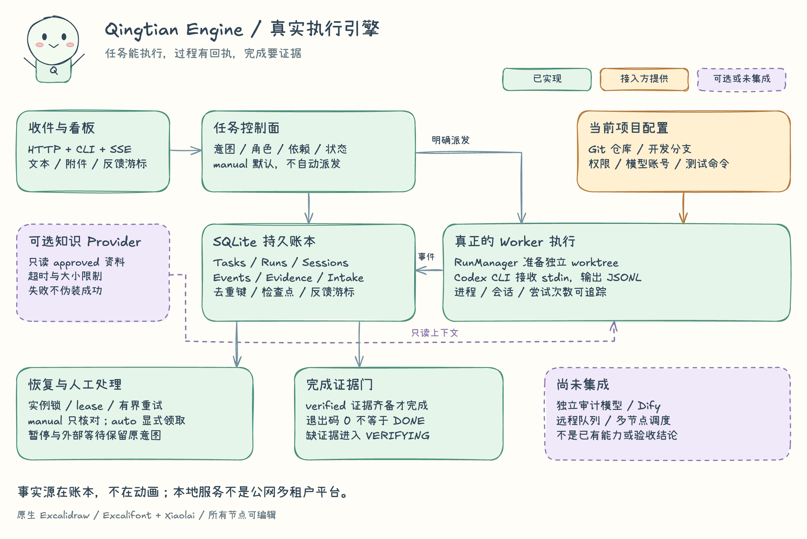

# Qingtian AI · 擎天真实任务引擎

[](https://github.com/ai-partner-lab/qingtianAI/actions/workflows/ci.yml) · [Apache-2.0](LICENSE) · Python 3.11+ · macOS / Linux

**当前稳定版：0.6.0。** 核心引擎、发行物、一键安装/卸载和本机 Codex 入口元数据接入已经通过独立回归。真实 provider 仍由采用方提供账户、权限与额度；Codex 宿主暂不提供有效角色规则的可靠回读，因此入口即使创建并置顶，`workflow_ready` 仍会诚实保持 `false / role_unverified`，不能把元数据成功理解为全部自动就绪。

0.5 从实际运行的本地引擎重新提取，默认入口不再是早期演示。历史版本和演示录像的证据不自动认证 0.6.0；本版门禁以当前提交和发布页回执为准。

## 文档入口（真实引擎）

- [快速上手与启动](docs/ADOPTION.md#快速上手)
- [接入与项目映射](docs/ADOPTION.md#接入与项目映射)
- [Codex 大管家入口与置顶边界](docs/MANAGER-ENTRY.md)
- [任务运行与运维](docs/OPERATIONS.md)
- [十二个协作场景：中断后只说一次继续](docs/SCENARIOS.md)
- [迁移与版本边界](docs/MIGRATION.md)
- [常见问题/排障](docs/FAQ.md)
- [术语与状态定义](docs/TERMINOLOGY.md)
- [架构](docs/ENGINE-ARCHITECTURE.md)
- [能力清单（已实现 / 接入后可用 / 未集成）](docs/ENGINE-CAPABILITIES.md)
- [Codex 本机能力清单与人工启用](docs/CODEX-CAPABILITIES.md)
- [API 合同](docs/ENGINE-API.md)
- [演示与离线示例](docs/DEMO.md)
- [源码包、runtime wheel 与发布边界](docs/RELEASING.md#artifact-contract)
- [旧版归档](docs/legacy/README-v0.4.md)

擎天将请求、任务、执行进程、证据与知识引用放进可追溯的本地工作台：收件箱、规划与依赖、独立 Git worktree、真实 Codex Worker、核对验收、报告反馈。角色是职责路由，不是人物动画；模型说“完成了”也不等于验收通过。

**中断后，不必逐个找执行者重述需求。** 在接入宿主任务读取与续接能力后，用户可以只对大管家说一次“继续”：先核实中断原因和恢复条件，找到原任务及 owner，沿用已批准方案与检查点，只续未完，再凭实际证据收尾。额度仍不足就保持阻塞；不自动充值、消费 reset、切便宜模型或恢复暂停的发布。

这是宿主辅助协调的使用场景，不是公共 CLI 开箱即有的全自动跨会话恢复。重启、失联交接、外部等待、证据补齐等 12 个场景均明确区分公库原语、宿主／适配、人工协调与后续规划。[场景与步骤](docs/SCENARIOS.md) · [对外讲法](docs/BRAND.md)



[可编辑 Excalidraw](docs/diagrams/engine-overview.excalidraw) · [架构](docs/ENGINE-ARCHITECTURE.md) · [能力与测试角色](docs/ENGINE-CAPABILITIES.md) · [HTTP/API](docs/ENGINE-API.md)

## 一条命令安装并启动

Python 3.11+（建议 3.12+）、macOS 或 Linux：

```bash
git clone https://github.com/ai-partner-lab/qingtianAI.git
cd qingtianAI
python3 scripts/install.py --start --manager-entry --workspace "$PWD" --open
```

安装器创建用户私有虚拟环境，安装三个 CLI，执行无凭据自检，再以空任务库启动本地控制台；`--manager-entry` 是创建或复用并置顶“擎天大管家入口”的明确授权。它不会启动模型轮次、恢复旧任务、导入旧电脑台账或派发代码。Codex 0.153.4 已验证入口创建、命名和内建置顶分区回读；由于宿主不提供角色规则回读，仍需按页面步骤人工接入角色并单独验收。

卸载只移除安装回执中登记的运行时和命令，默认保留任务数据：

```bash
python3 scripts/uninstall.py
```

只有明确传入 `--purge-data --yes --data-dir ...` 且目录含有效擎天数据库时才会清理数据。安装/卸载不会覆盖已有同名命令或无回执目录。

## 三分钟手动启动

Python 3.11+（建议 3.12+）、macOS 或 Linux。默认启动不需要 npm、Docker、模型凭据或 Obsidian。

```bash
git clone https://github.com/ai-partner-lab/qingtianAI.git
cd qingtianAI
python3 -m venv .venv
source .venv/bin/activate
python -m pip install -e .
qingtian doctor
qingtian selftest
qingtian quickstart --open
```

打开 [本地控制台](http://127.0.0.1:8766/)。首次使用新数据目录时是**空任务库 + manual**；重启会保留该目录已有任务，不导入旧台账，不自动启动 Worker。点击“能力与上手”逐步查看接入方法。

`quickstart` 默认只启动控制台，不创建 Codex 入口。显式加 `--manager-entry` 代表允许当前数据目录创建或复用一个真实 Codex“擎天大管家入口”；创建意图会先持久化，响应丢失时不会盲目重建。该动作不启动模型轮次或恢复旧任务。首次接入和后续恢复必须沿用同一数据目录；`--skip-manager-entry` 为旧调用兼容保留，不能与 opt-in 同时使用。

入口的 `metadata_ready` 只表示当前 scope 匹配的名称/置顶元数据回读；`role_configuration` 中新建时的规则提交记录不等于有效角色已核验，复用或显式绑定且没有本地创建回执时角色来源为 `unknown`。当前 `workflow_ready=false`，即使命名和置顶元数据成功，整体仍为 `partial / role_unverified`。用 `qingtian manager-entry instructions` 查看人工接入规则；`status`/`instructions` 是只读命令，退出 0 不代表工作流就绪，`init`/`sync` 在当前未完成角色验收时退出 2。[入口使用与兼容说明](docs/MANAGER-ENTRY.md)

自动置顶优先以 `thread/read` 回读 `isPinned=true` 为成功依据。对已识别的 Codex 0.153.4，0.6.0 还会核验服务端握手与受保护内建置顶分区，再移动并回读同一线程；本机真实接入已经得到 `pinned=true`、`pin_evidence_source=builtin_section`。未知版本或缺失身份仍保守返回未核验。公共任务详情已有结构化会话导航与 ID 复制；有效角色规则和一次新的真实协调旅程仍需独立验收。[入口说明](docs/MANAGER-ENTRY.md)

- 默认数据目录是 `~/.local/share/qingtian/engine`，不写源码或安装目录；支持 `QINGTIAN_ENGINE_HOME` 或全局 `--data-dir`。
- `qingtian stop` 停止该数据目录的控制台，不等于取消已派发的独立 Worker。
- `qingtian tour --port 8767 --open` 用临时库展示**同一引擎**的合成卡片；Ctrl+C 退出清理，不调用模型。
- `qingtian selftest` 无凭据核验三种角色默认、状态、幂等、证据门、持久化和 manual 不自动派发。
- 当前没有多用户认证，不要向公网开放端口。

## 执行自己的真实项目

本地控制台可在不调用模型的 manual 模式启动；代码执行需要使用者安装并登录 Codex、注册授权仓库和已有开发基线，并完成自己的实际接入验收：

```bash
codex login
qingtian project register sample --repo /absolute/path/to/your-repo --base dev --role backend
qingtian project list
qingtian task add --title "Add a small regression test" --project sample --worker cli --owner backend
```

将返回的新 task ID 与你编写的任务说明文件传入：

```bash
qingtian dispatch TASK_ID --prompt-file /absolute/path/to/instructions.md
qingtian task show TASK_ID
qingtian feedback --consumer maintainer --peek
```

缺项目映射会阻止真实执行，不猜旧电脑路径。每个代码任务创建独立 worktree/分支；不自动合并或推送母仓库。`main/master/origin/main/origin/master` 不能作为执行基线。scope 注册字段的实际边界见接入手册，不是权限沙箱。

真实 Codex 必须显式接入。执行采用 stdin + `codex exec --json`，不绕过沙箱。[官方非交互执行说明](https://learn.chatgpt.com/docs/non-interactive-mode)

新执行仅接受 `gpt-5.6-sol` / `gpt-6-astra`、精确的 `medium` / `high` / `xhigh` / `ultra` 推理枚举及独立的 `standard` / `fast` 速度，不做 clamp。manager 默认 Astra/ultra/fast，executor 与 planner 默认 Sol/high/standard；显式参数 > 环境变量 > 路由/角色默认。执行还要求使用者人工审查并显式启用仍有效的本机 capability manifest；本机广告不证明账户权限、额度或实际 served tier。新 run 冻结七个执行目标参数；旧历史缺完整不可变快照时拒绝 resume，不猜测或回填。[配置与续接](docs/ADOPTION.md#模型与推理配置) · [能力清单](docs/CODEX-CAPABILITIES.md)

manual 可写并允许明确 dispatch 或实施请求，不是只读。auto 会自动领取符合规则的任务，请先在隔离环境理解其范围。[接入手册](docs/ADOPTION.md)

## 当前能力

| 已提取实现 | 接入方提供 |
|---|---|
| SQLite task/run/session/event/evidence、幂等、父子依赖 | 当前目标、范围与验收规则 |
| 文本/附件 intake、确定性规划、通用职责路由 | 可选模型规划的授权 workspace |
| Codex 子进程、JSONL、PID/进程组、取消与 resume | Codex 登录、模型额度、仓库 |
| worktree、事务证据门、有界恢复、lease/fencing、检查点 | 真实测试、部署和独立验收 |
| SSE 看板、等待责任/下一步/期限/来源、24 小时报告、反馈游标 | 通知平台、团队访问层 |
| HTTP 派发准入回执、声明式发布事实登记 | 外部 host ack、发布/部署执行与独立复核 |
| Obsidian 兼容 Markdown 知识库、只读 approved 上下文 | 自己的文档、来源审查与维护 |

不内建视觉像素门禁、设备实验室、Dify/Hatchet/OpenHands/Langfuse 集成或跨机器分布式调度。模型标签、角色名称与动画不能证明这些集成已完成。[完整能力和黑盒测试清单](docs/ENGINE-CAPABILITIES.md)

## 知识库：带走体系，不带走内容

`qingtian-kb` 随包安装。知识工作区放在源码之外：

```bash
mkdir -p /absolute/path/to/private-knowledge
cd /absolute/path/to/private-knowledge
qingtian-kb init --workspace /absolute/path/to/your-repo --project sample
qingtian-kb plan
# 先审查 config/sources.json 的来源范围，再采集：
qingtian-kb ingest
qingtian-kb validate
qingtian knowledge configure --root /absolute/path/to/private-knowledge
qingtian knowledge status
```

Obsidian 可以打开这里的 `vault/`，不用 Obsidian 也能编辑 Markdown。PDF 提取可在源码目录另装 `pip install -e '.[pdf]'`。

Worker 默认只取合格的 approved 引用。候选和历史不是当前事实，更不是新的执行授权；未知来源不能默认为可信。`qingtian knowledge disable` 关闭检索但不删除知识文件。详见 [知识库接入步骤](docs/ADOPTION.md#接入自己的知识库)。

## 验证与分发

```bash
python -m pip install -e '.[dev]'
python -m unittest discover -s tests -v
python -m build
qingtian bundle --root . --output release/qingtianAI.tar.gz
qingtian bundle-verify --bundle release/qingtianAI.tar.gz
```

Wheel 包含真实引擎、静态控制台、知识模块及显式 legacy 入口；源码包还包含文档、Excalidraw、接口和测试。CI 检查公开边界、Python 矩阵、离开 checkout 的 wheel 和源码包复验。[发布清单](docs/RELEASING.md)

公开仓库不含接入方规则、知识正文、历史任务/会话、数据库、凭据、本机映射、capability manifest、prompt spool、worktree 或生产资料。生成的数据保留在接入方私有目录；内置扫描不是完整 DLP。

## 导航与旧版

| 阅读目的 | 文档 |
|---|---|
| 安装、项目映射、知识库 | [接入手册](docs/ADOPTION.md) |
| Codex 大管家入口 | [创建、复用、跳过与置顶核验](docs/MANAGER-ENTRY.md) |
| 实现结构、能力与接口 | [架构](docs/ENGINE-ARCHITECTURE.md) · [能力与测试](docs/ENGINE-CAPABILITIES.md) · [API](docs/ENGINE-API.md) |
| 演示与介绍 | [演示脚本](docs/DEMO.md) · [品宣](docs/BRAND.md) · [Excalidraw 源文件与字体说明](docs/diagrams/engine-README.md) |
| 用户旅程与续接 | [十二场景](docs/SCENARIOS.md) · [接入续接约定](docs/ADOPTION.md#把续接约定接入自己的工作流) |
| 使用与排障 | [运维](docs/OPERATIONS.md) · [FAQ](docs/FAQ.md) · [术语](docs/TERMINOLOGY.md) |
| 升级与分发 | [迁移](docs/MIGRATION.md) · [发布清单](docs/RELEASING.md) · [安全](SECURITY.md) · [变更](CHANGELOG.md) |

早期 `qingtian_core` 和七步动画保留为 **`qingtian-lab` / `qingtian legacy`**。它们的状态模型、schemas、examples 与真实引擎不同，不能互换数据库，也不是新引擎验收证据。[旧版归档](docs/legacy/README-v0.4.md)
