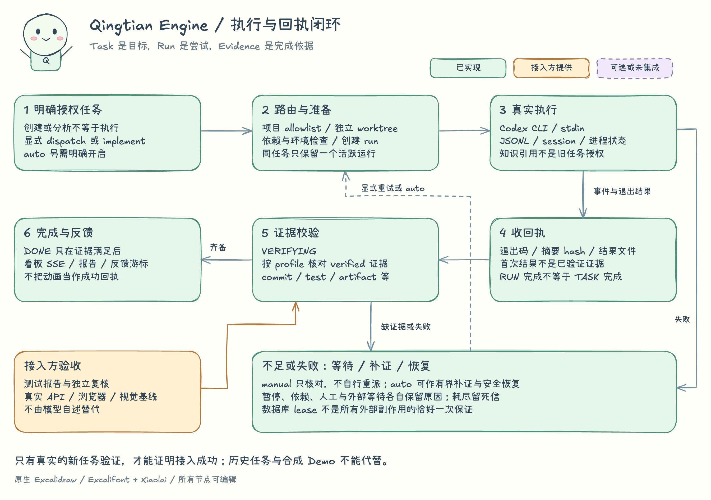

# Qingtian Engine：真实执行架构

本文描述 `qingtian_engine/` 的实现，不把展示动画、合成任务或能力目录当成真实调度。公开包不附带任何团队的数据库、会话、知识正文、凭据或业务工作区。

[编辑 Excalidraw 源文件](diagrams/engine-overview.excalidraw) · [SVG](diagrams/engine-overview.svg)

## 一套控制面，两种明确的运行模式

引擎把请求转为持久任务，按项目映射准备独立 Git worktree，启动真实 Codex CLI 子进程，消费 JSONL 事件，并把运行结果交给证据完成门。`owner_session` 是职责路由代码，不是已经连接的真实人物或独立模型服务。

| 层 | 已实现模块 | 事实与责任边界 |
|---|---|---|
| 请求入口 | `server.py`、`cli.py`、`intake.py` | 浏览器 multipart intake、直接任务 API、CLI。默认确定性规划；显式实施意图才启动 intake 的执行。 |
| 任务控制 | `service.py`、`router.py` | 父子任务、阻塞依赖、状态转换、负责人、环境与证据策略。依赖关系不是任意 DAG 的形式化验证器。 |
| 持久账本 | `db.py` | SQLite WAL：task、run、session、event、evidence、intake、审计、去重键及游标。不是把事件投影倒推成事实源。 |
| 执行层 | `runner.py`、`worktrees.py`、`worker_entry.py` | 按任务创建运行尝试和进程组，准备 worktree，以 stdin 传提示，运行 `codex exec --json`，支持有会话 ID 的 resume。 |
| 协调与恢复 | `runtime_mode.py`、`runtime.py`、`coordinator.py` | 实例锁、PID 所有权、后台核对、协调器租约、检查点、重试预算、死信记录。 |
| 可观察性 | `server.py`、`reporting.py`、`service.py` | SSE 版本快照与心跳、看板、任务详情、滚动 24 小时报告、消费者反馈游标。 |
| 知识上下文 | `knowledge.py` 与 Worker 接线 | 只读 stdin JSON Provider，默认仅 approved；失败明确记录，不伪装检索成功、不恢复旧任务。 |

`manual` 是默认的**可写工作台**，不是只读模式。它允许创建任务、明确 dispatch、明确实施 intake；后台仅核对状态，不自动领取、基础设施恢复或补证执行。`auto` 是显式选择，后台可调度符合条件的任务并进行有界恢复。`init` 不扫描历史台账；导入需要单独显式命令。

`analyze` 收件创建的父子任务会持久标记 `authorization_policy=analysis-only`；台账导入标记为 `reference-only`。它们不是待执行授权，不能因重启、改显示状态、切 auto 或重试变成实施任务。要实施，应另建明确授权的新任务，而不是把旧资料或分析请求当作执行许可。

## 真实执行和回执闭环

[编辑 Excalidraw 源文件](diagrams/engine-lifecycle.excalidraw) · [SVG](diagrams/engine-lifecycle.svg)

一次工作包含三个不同事实：

1. **任务 task**：当前授权的目标、范围、依赖、负责人和状态。
2. **运行 run**：某次具体执行的 attempt、PID、进程组、会话 ID、退出码和结果摘要 hash。
3. **证据 evidence**：可追溯结果及其 `verified` 标记。run 退出码为零不等于 task 已完成。

Worker 成功退出后进入 `VERIFYING`。首次执行产生的结果不自动成为已验证证据。完成门根据任务 profile 要求 verified 证据：代码任务通常需要 commit/test，部署任务还需 deploy/smoke；browser、qa、artifact 有相应要求。未补齐不能称为 `DONE`。CLI 可以由操作方明确登记 verified；补证运行也能标记符合规则的结果。**这里是证据治理机制，不是对测试、部署或附件内容的独立密码学证明。** 接入方仍要提供真实可复核产物，不能把字符串“pass”当验收依据。

引擎内部状态包含 `INBOX`、`PLANNED`、`QUEUED`、`RUNNING`、`WAITING`、`VERIFYING`、`FAILED`、`DONE`、`CANCELED`。看板的 `PAUSED`、`PLAN_ONLY` 和细分等待类别还有投影逻辑，不能假设每个看板栏等于同名持久状态。

## 去重、恢复与“恰好一次”的边界

- task 幂等键、event 去重键、evidence 三元唯一键、intake 幂等键与附件 SHA256 去重均有持久约束。
- run 的 task/attempt 唯一；部分唯一索引阻止同一任务存在两个 QUEUED/RUNNING 记录。
- SQLite 租约通过 `BEGIN IMMEDIATE` 竞争，持有者切换增加 fencing token；检查点保存每轮协调状态。
- 实例文件锁约束同一数据目录的服务所有权；非持有者可保持 STANDBY，不能据此宣称失去任务。
- `auto` 的默认后台循环每轮最多新增 1 个运行、全局最多 3 个活跃运行；实际可调度范围还受任务类型、依赖、环境和暂停标记限制。
- 失败、陈旧外部心跳和补证欠账分别处理；补证有次数上限，耗尽后留下等待/死信，不无限宣称“正在恢复”。

这些是本机数据库与进程协调措施。fencing token 尚未作为所有外部工具写入的服务端拒绝令牌；不能承诺跨机器强隔离、外部副作用恰好一次、断电零丢失或无限期自治。消费侧收到重试任务仍需幂等处理。

## 接入边界

接入方提供当前项目的 Git 仓库、可用开发分支、允许的目录、Codex 安装与登录，以及真实测试/部署命令。项目注册表按名字、角色与仓库精确匹配；缺配置视为空 allowlist，不回退到工作目录或记忆中的路径。它拒绝把引擎源目录、运行数据目录或安装包目录注册成业务仓库。可选 scope 将 Codex cwd 设为工作树中的对应子目录，并再次核对真实路径是否仍在工作树内；它不是独立安全沙箱。真实隔离还依赖 Codex 的 workspace-write 沙箱与本机权限。

知识库 Provider 属于独立进程契约。引擎支持包内 `builtin-module` 和显式 `external-executable`，已实现调用和 Worker 接线，但公开包不携带项目知识正文；接入方要初始化自己的知识工作区并显式启用。Provider 不可用时记录 `knowledge.unavailable`，当前任务按原授权继续。候选结果只能显式查询且标成线索；默认 Worker 不请求历史通道。知识检索不构成任务授权，也不证明资料描述的实现已部署。

可选 Codex Planner 是另一条读取与模型调用边界：仅在显式设置 `QINGTIAN_INTAKE_PLANNER=codex` 后启用，提交 intake 时以 `--sandbox read-only --ephemeral` 启动真实 Codex。它使用服务启动时的 `--workspace`（默认启动目录）作为 cwd；Worker 的项目注册表不约束此规划目录。启用前应指定获准读取的、范围明确且不含无关敏感资料的目录。只读沙箱不等于不读取本机文件、不调用模型或不向提供方传送上下文；`--ephemeral` 也不是提供方零留存承诺。默认确定性 Planner 不调用模型。

可选项需要区分两类：

- **已有可选代码**：Codex 规划适配器、知识库 Provider 调用、恢复协调器开关。
- **未接通的扩展方向**：独立审计模型、Dify 工作流/知识、Hatchet、OpenHands、Langfuse、远程多节点控制。disabled 插槽或注册表里的 READY 字样不代表连接和健康探测成功。

## 安全与开源边界

HTTP 仅监听 loopback，校验 Host/端口并拒绝跨 Origin 写请求，附带 CSP、禁嵌入和 no-store 头。但它没有多用户认证、RBAC、TLS 终止、配额或完整 DLP；本机能访问端口的程序仍在信任边界内。不要直接暴露到公网或团队网络。

事件持久化保留有界元数据和摘要 hash，不保存原始模型全文；这不等于整台机器不产生日志。Codex 自身的会话存储、临时提示、受控原始附件、SQLite、Git worktree 仍含私有资料，需要接入方制定访问、备份和留存策略。附件魔数/MIME/hash 检查不是病毒扫描或完整文档语义审查。

引擎保留明确授权和产品策略冲突上报机制。遇到不可覆盖的约束，应报告具体冲突，不得静默删除功能、伪造通过或将历史资料当作新的部署授权。

## 核查依据

实现路径：`qingtian_engine/{server,intake,service,db,runner,worker_entry,worktrees,coordinator,runtime,runtime_mode,project_config,knowledge,reporting}.py`。回归证据见 `tests/atlas/`；执行本轮测试后才可在交付中报告数量和结果。本说明不是未经执行的验收报告。
