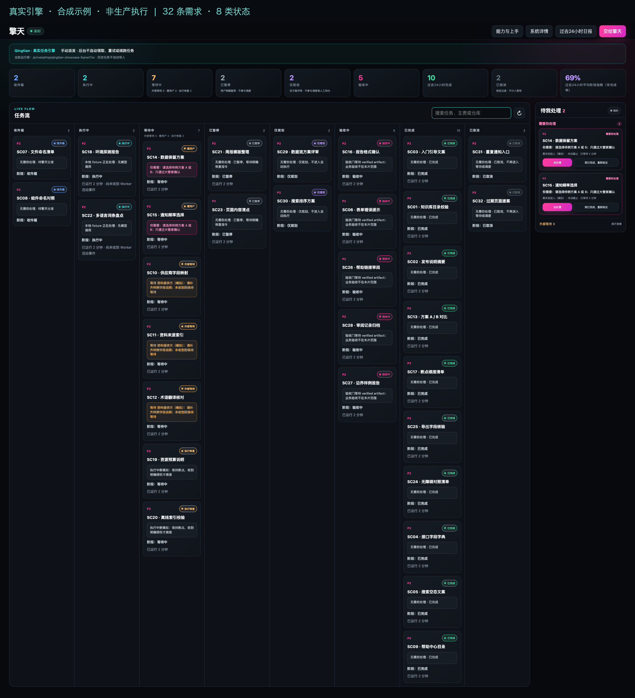
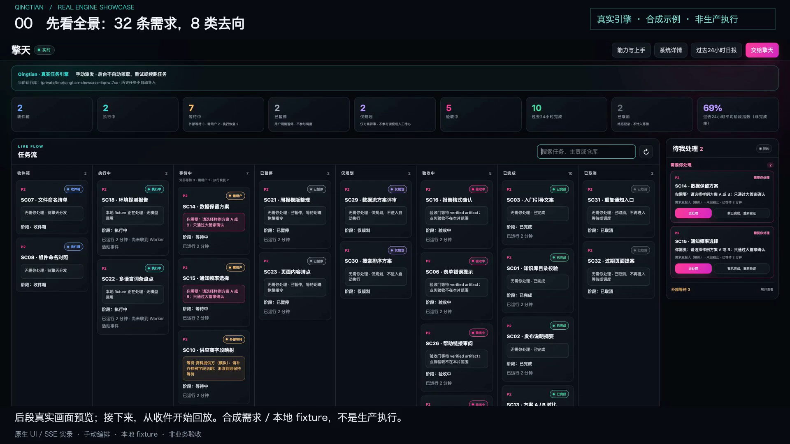

# 多任务看板实录：真实引擎，合成示例

**本地实录已生成并完成媒体核验，尚未远程发布。** 本轮使用独立演示库中的 **32 条新建通用合成需求**，已生成完整看板截图、229.5 秒完整 MP4 与 76 秒短片。独立状态／事件检查为 23 项中 22 项通过、1 项 SSE 失败；媒体机械检查 11 项通过，22 个关键抽帧及封面、长图检查通过。不存在本范围的媒体交付阻断，但不能合并成“全部功能验收通过”。

**真实引擎 · 合成示例 · 非生产执行。** 本地品宣资产收录两张合成截图和已核验的 76 秒精华 MP4：[播放/下载76秒精华版](assets/showcase/qingtian-showcase-short.mp4)。完整 MP4、原始 WebM、数据库和私有审计材料仍在仓库外，没有远程下载地址；源码示例见 [showcase README](../examples/showcase/README.md)。本地纳入不等于远程发布，也不等于已进入新的发行包。

## 完整看板实际画面



本轮原生 UI 的完整长截图，2240 × 2459，保留“合成示例／非生产执行”标识。**运行库路径为隔离合成演示实例**，不含用户名或业务仓库；这不是公开其他本机路径的许可。图来自新演示库，没有使用或重绘原用户的私有截图。



1920 × 1080 封面展示同次录像后段预览；它不是全部 32 卡片都展开的长截图。运行库路径同为隔离合成演示实例。两图保持录制方交付字节，未遮改状态；界面阶段进度数字不作为完成或业务验收证据。总览小字适合桌面全屏，不宣称手机端全部卡片细字可读。

独立来源核对确认：poster 与主片 2 秒抽帧的 PNG 文件摘要一致，公开长板去掉新增标识横幅后的原生内容像素与原始完整截图一致；这不是重绘看板。隐私观察覆盖已检查图片及关键抽帧，不作逐像素／每帧的绝对保证。

## 三句话讲清“真实”

- **真实引擎：** 现有 Python service API 实际创建并流转任务，HTTP 和原生 SSE 看板回读；没有修改 DOM、制作状态动画或直接改库冒充流转。
- **合成示例：** manual 服务由脚本编排。RUNNING 的外部心跳表示本地 fixture 活动；fixture 只生成并核验带 `synthetic=true` 的 JSON 清单，不是 Codex managed Worker。
- **非生产执行：** 本轮审计记录 **0 模型调用、0 managed Worker run、0 业务执行**。没有触发 manager-entry、真实宿主跨会话通信、额度恢复或生产部署。

中断、恢复授权、外部资料和用户选择都是明确的合成输入。“真实流转”描述引擎处理这些输入与状态事实，不意味着 32 个智能体在自动执行真实需求。

## 八类去向与实际终局

八列是分支，不是每个任务都必须经过的八步流水线；完整 32 条轨迹与预期合成方案对账。PAUSED 是用户暂停 WAITING 的**展示投影**，PLAN_ONLY 是 analysis-only 的**展示类别**，都不能称为新增 raw 状态码。

| 看板位置 | 最终数量 | 看懂什么与保留的边界 |
|---|---|---|
| 收件箱 | 2 | 已收到不等于已批准实施；PLANNED／QUEUED 也可投影到收件箱。 |
| 执行中 | 2 | 本地 fixture 的真实心跳记录，不是模型 Worker 执行证据。 |
| 等待中 | 7 | 外部资料、用户决策与恢复等待分列；提醒记账不等于通知送达。 |
| 已暂停 | 2 | 保留暂停，不因为其他任务继续而恢复发布。 |
| 仅规划 | 2 | 只分析、不产生实施授权。 |
| 验收中 | 5 | 缺证据保持待验收，退出码和 `item.completed` 不算完成。 |
| 已完成 | 10 | 仅通过本地合成 JSON artifact 合同，不证明真实业务 QA。 |
| 已取消 | 2 | 保留取消记录，不伪装为完成。 |

本轮有 **307 条持久服务事件**。3 次缺少或未核验证据的 DONE 请求被真实门禁拒绝；10 条完成任务均先有已核验的本地 fixture artifact，再由 reconciler 完成。SC24 先只生成 8/10 项，检查失败；补齐 10 项后再验收，旧失败保留。这些证据只证明合成清单与引擎门禁，不是产品端到端验收。

## 必须一起展示的 SSE 限制

**历史录制的 P2：本片逐事件可靠投递没有通过，录制当轮未修改核心。** 49 条原生 SSE 消息的 `changes` 含 294 个唯一事件 ID，307 条持久事件中有 13 条没有出现在变化列表。录制所用的旧路径先查 changes、再查 dashboard，并用后者 version 前移游标，不能解释成“同包都收到了”。这不是当前 RC 的读取/游标合同。

最终 SSE 全量 dashboard 的 32 项 raw/display 与最终导出一致；脚本也逐步通过 HTTP 全量状态与原生 UI 列位置对账。因此录像可展示这一轮最终看板和合成状态流转，**不能宣称逐事件无丢失、可靠通知或自动化平台验收已通过**。

当前 0.6.0rc1 源码已改为原子读取快照、分页 changes 和独立消费 cursor，并已有有限范围的独立运行时复核与临时实例验证。该修复不回填旧录像、不改变 307/294/13 的历史事实，原视频字节保持不变；最终发行候选仍须按其完整源码/包 hash 单独验收，不能沿用旧片或其他候选的通过记录。[当前 SSE 合同](ENGINE-API.md#sse-版本合同)

## 成片规格与章节

| 本地文件 | 已生成规格 | 剪辑方式 |
|---|---|---|
| `qingtian-showcase-full.mp4` | 229.5 秒（3:49.5），H.264，1920 × 1080，30 fps，SAR 1:1。 | 片头 8 秒取自同次录像后段，然后顺序 1× 回放；详情镜头有裁切放大。 |
| [qingtian-showcase-short.mp4](assets/showcase/qingtian-showcase-short.mp4) | 76 秒（1:16），同规格，6,549,535 bytes。 | 同次主片的跳切选段，1×，没有加速；不是完整连续过程。已原样纳入本地品宣资产。 |

原始 WebM 容器时长是 **223.32 秒**；**221.82 秒只是编排墙钟终点**，不是原片时长。成片无音轨。独立复核覆盖冻结摘要、FFprobe、完整解码、黑屏检测、剪辑映射和关键抽帧；未发现解码错误或黑屏区间。浏览器播放／seek 的回执来自录制方，不冒充独立浏览器复演；媒体核验不等于生产、模型或逐事件可靠性验收。

以下时间码来自本轮交付的主片章节，按秒显示；命令到镜头采用墙钟映射，容差 1 秒，不是逐帧事件到达精度。另行复演时必须使用新产物自己的时间码。

| 主片位置 | 内容 |
|---|---|
| 00:00 | 后段全景预览，非开场时的初始任务状态。 |
| 00:08 | 需求汇入同一处。 |
| 00:24 | 先规划，再决定执行。 |
| 00:42 | 并发推进，各自留痕。 |
| 01:01 | 等待有原因，也有负责人。 |
| 01:22 | 只把必要决策交给你。 |
| 01:42 | 中断后，明确合成授权才续接。 |
| 02:06 | 主动暂停，不等于普通等待。 |
| 02:25 | 没有证据，不能完成。 |
| 02:43 | 验收失败，返修再送验。 |
| 03:05 | 完成与取消，都有来路。 |
| 03:27 | 32 条需求，8 类去向。 |

## 如何在自己的环境复演

先阅读 [示例依赖与复演说明](../examples/showcase/README.md#依赖)，准备 Python 3.11+、Node.js、Playwright/Chromium、`@napi-rs/canvas`、含 libx264 的 FFmpeg/FFprobe 和可加载的中文字体；Node 依赖需要可被 `require()` 发现。这些不是新增产品运行时依赖，本文不会自动安装或执行。

以下命令从仓库根目录运行。它们会创建新的合成任务、独立临时库、随机 loopback 服务和录像，**不是只读命令**；只在已授权的本地演示环境执行，不指向业务库或旧输出。`PYTHON` 应选择可导入本仓库的解释器，字体占位路径必须换成实际可用字体。

```sh
SHOWCASE_OUT="$(mktemp -d /tmp/qingtian-showcase-output-XXXXXX)"
node examples/showcase/record.cjs --output "$SHOWCASE_OUT" --python "${PYTHON:-python3}" --pace 1
python3 examples/showcase/verify_recording.py "$SHOWCASE_OUT"
node examples/showcase/render.cjs --input "$SHOWCASE_OUT" --ffmpeg ffmpeg --ffprobe ffprobe --font /path/to/chinese-font.ttf
node examples/showcase/qa_media.cjs "$SHOWCASE_OUT"
node examples/showcase/check_playback.cjs "$SHOWCASE_OUT"
```

每次使用仓库外新输出目录；脚本拒绝覆盖已有 `timeline.jsonl` 的录制目录。`--pace 0.01` 仅用于逻辑彩排，不能把其结果叫作 1× 正式实录。中文字体加载失败应停止，不静默切成缺字字体。

只重新剪辑现有素材时运行 render 和 qa_media 两步，不重启引擎；但会覆盖该输出目录中的 MP4、字幕、poster 和媒体报告，操作前另存既有成片与回执。播放检查会启动自有随机 loopback 文件服务并在结束时停止。审计库及失败记录保留，不能批量清理其他目录。

源码收录 [README](../examples/showcase/README.md)、[场景定义](../examples/showcase/scenario.json)、[引擎桥接](../examples/showcase/engine_bridge.py)、[录制](../examples/showcase/record.cjs)、[状态核验](../examples/showcase/verify_recording.py)、[剪辑](../examples/showcase/render.cjs)、[媒体检查](../examples/showcase/qa_media.cjs)、[播放检查](../examples/showcase/check_playback.cjs)八个文件。视频白名单仅含用户指定的 `docs/assets/showcase/qingtian-showcase-short.mp4`；完整片、原始录像、数据库、私有审计和原用户截图不纳入。重新复演的输出仍须写入仓库外新目录，不能覆盖已核验品宣资产。

## 版本与能力边界

复演可能受实际源码、浏览器、字体和依赖影响。原录制使用当时的工作区，包含未提交改动；基线 commit 不能单独证明可重现同一画面，须对照录制回执中的逐文件 SHA。新增文档和图不将旧候选变成包含新功能的新发行版。

录制负责方的 `gpt-6-astra / xhigh` 配置不等于公共引擎默认或全链路策略。实际 Worker 命令由运行策略决定，片中技术详情的模型字段只是配置，本轮没有模型执行证据。有效角色回读、桌面置顶、当前入口适配器真实端到端和 Windows 原生仍有未验收项；首次发现可能不完整，`workflow_ready=false`。

本片补充 [十二场景](SCENARIOS.md)，不验证真实账户额度恢复、宿主跨会话续接、公共深链导航、自动跨机调度或生产业务。[演示讲稿](DEMO.md) · [品宣说明](BRAND.md) · [能力与验收](ENGINE-CAPABILITIES.md)
