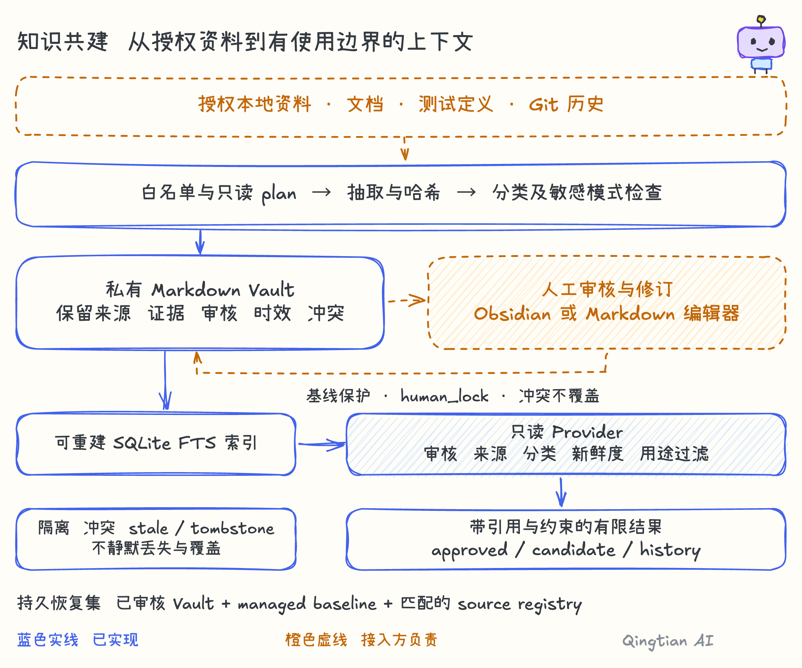

> Legacy laboratory archive: these documents describe the separate pre-0.5 runtime. Use `qingtian-lab` for the commands below; they are not the default engine or its acceptance evidence. See [current engine](../ENGINE-ARCHITECTURE.md).

# Architecture

Qingtian AI packages two reusable runtimes with separate authorities and storage.
The control plane coordinates work and records what happened. The Knowledge Hub
turns explicitly selected project material into evidence-bound retrieval results.
Neither layer contains an adopter's business policy or private data.

## System boundary

[Editable Excalidraw source](../diagrams/01-overall.excalidraw) ·
[Unified architecture board](../diagrams/qingtian-architecture.excalidraw).
Blue solid lines are implemented capabilities; orange dashed lines are adopter-owned.

The dotted conceptual connection is intentionally not an implicit database bridge.
An integration may retrieve context before a run and record content hashes or
knowledge identifiers as evidence afterward. It should not copy an entire private
Vault into the control database or treat an unreviewed retrieval result as fact.

## Control plane

### Guided local experience

`qingtian demo-web` bundles a loopback-only Python HTTP server and dependency-free
browser assets. Its explicit seven-step guide maps six animated roles onto real
`QingtianStore` operations, including `UNKNOWN`, checkpoint handoff and final `DONE`.
It uses synthetic data and the offline Echo provider. The fixed teaching flow is
not an autonomous scheduler, production dashboard or Knowledge Hub ingestion UI.
See [the demo contract and lifetime](DEMO.md).

### Durable records

- **Task** describes an objective, scope, acceptance criteria, lifecycle state, and
  revision.
- **Session** identifies one execution context attached to a task.
- **Run** records one bounded execution attempt, executor, idempotency key, request hash,
  result state, and timestamps.
- **Evidence** records an observed result about a Task, Session, or Run.
- **Checkpoint** captures resumable references and a canonical integrity hash.
- **Knowledge record** is a small, explicitly scoped control-plane fact or decision.

The SQLite store is the local authority for these records. Lifecycle transitions are
validated. Task transitions expose a compare-and-swap revision; Session and Run
transitions are serialized in SQLite transactions and constrained by legal source
states. Adapters still need stable operation identity and reconciliation around any
external side effect.

### Idempotency and uncertainty

External actions may finish even when their acknowledgement is lost. Retrying them
blindly can duplicate a message, charge, release, or other side effect. Qingtian
associates repeatable work with an idempotency key and represents unresolved outcomes
as `UNKNOWN`. Adapters must reconcile the remote system before deciding whether a new
attempt is safe.

### Providers

The model gateway routes through named provider adapters. The bundled echo provider
is deterministic and offline; it proves the interface without a credential or network
call. Real adapters own credential loading, network security, timeout, retry,
idempotency, usage, and data-retention behavior. The reference gateway is not a
hosted proxy or credential manager.

The request route and requested model are inputs, not proof of execution. Every
adapter returns a `ProviderResponse` with an explicit `reported_model`: the actual
model reported by the provider after aliasing or fallback, or `None` (JSON `null`) if
it cannot be established. The gateway preserves that unknown state instead of copying
the requested model into effective-model lineage.

### Verification and release artifacts

A project adapter can declare verification checks and their side-effect class. Safe
read-only checks are preferred. Local writes require an explicit flag, and executing
adapter commands requires a separate trust acknowledgement because commands are
ordinary local programs, not sandboxed code.

Verification receipts record check results, execution policy and output hashes.
Adopters link those receipts to Evidence and record reports or untested claims separately.
Release scanning and manifest-verified bundles help transfer source without silently
including obvious credentials or host-specific paths. They are release guardrails,
not a complete data-loss-prevention system.

## Knowledge Hub

[Editable Excalidraw source](../diagrams/03-knowledge.excalidraw).

### Evidence and authority

Managed entries retain source locators, content hashes, evidence level, claim scope,
review state, freshness, conflict state, and privacy classification. Historical or
candidate material remains non-authoritative. Retrieval mode changes what can be
returned; it does not promote the underlying evidence.

For repository-derived `sqlite-index` material, unknown repository authority fails
closed for `approved` and `candidate` retrieval. When `history` is explicitly
requested, an otherwise eligible E1 item with unknown repository authority may be
exposed only as a non-authoritative investigation lead; it carries
`eligible_for_generation=false`. Conflicted authority remains excluded, and the
history exception does not establish current truth or generation eligibility. Human
Vault notes instead pass their own review, freshness, conflict, classification, and
provenance gates.

### Human and machine ownership

Generated notes retain a managed baseline hash. If a person changes a managed note,
the next ingestion records a conflict instead of overwriting it. A human lock keeps a
note human-owned. Removed or unavailable sources become stale or tombstoned evidence
rather than disappearing without a trace.

### Recovery

The reviewed Vault, managed baseline, and matching source registry form the durable
recovery set. The search database is disposable and can be rebuilt. A recovery must
restore one consistent snapshot, verify hashes, rebuild the index, validate the Vault,
and only then re-enable retrieval.

## Knowledge types stay distinct

The control plane's scoped knowledge records are deliberately small and operational:
for example, a verified architectural decision tied to a run. The Knowledge Hub holds
document projections with richer provenance and review metadata. They currently have
different schemas and stores.

A safe adapter normally passes bounded retrieval results into a run and records only
the identifiers, revisions, hashes, retrieval mode, and usage constraints needed for
reproducibility. Promotion into a control-plane record should be an explicit reviewed
operation, never an automatic consequence of search relevance.

## Trust and privacy assumptions

- File discovery is allowlist-based. A source configuration grants read authority only
  for its bounded roots and patterns.
- Pattern matching cannot detect every secret or personal-data form. Encoded,
  fragmented, image-only, encrypted, or novel data may pass a scanner.
- `caller_id` and `purpose` in the local provider contract are labels, not authenticated
  identities.
- SQLite and Markdown are not encrypted storage. Filesystem permissions, encryption,
  backups, and retention are deployment responsibilities.
- A successful local check is evidence about that check only. It does not prove a
  deployment, release, product behavior, or external approval.

## Production extension points

A production deployment should provide, test, and operate:

1. workload identity and role/purpose authorization;
2. project, scope, classification, and retrieval-mode enforcement;
3. provider secrets in a managed secret store;
4. authenticated transport, rate limits, timeouts, and concurrency controls;
5. privacy-safe audit logs and evidence retention;
6. deletion and policy-change propagation;
7. encrypted storage, backup, restore, and disaster-recovery drills;
8. metrics, tracing, capacity limits, SLOs, and incident response;
9. contract compatibility and database migration tests;
10. emergency disable and rollback paths.

See [Adoption](ADOPTION.md) for an incremental rollout sequence and [Contracts](CONTRACTS.md)
for the public schema surfaces.
