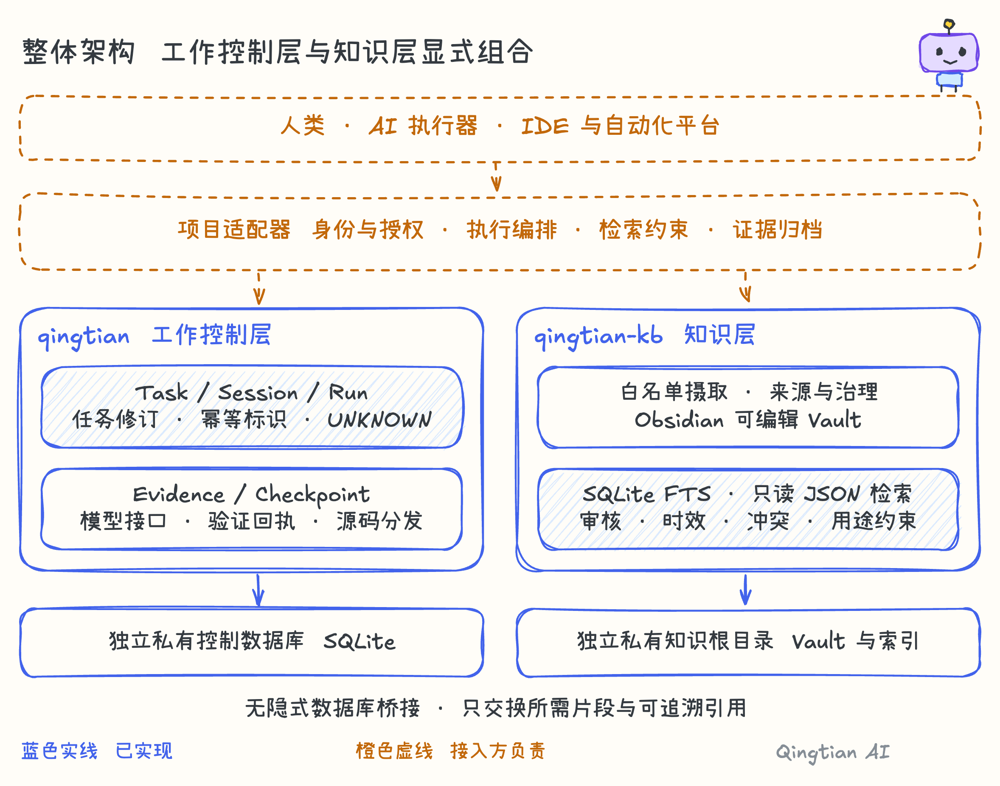

> Legacy laboratory archive: these documents describe the separate pre-0.5 runtime. Use `qingtian-lab` for the commands below; they are not the default engine or its acceptance evidence. See [current engine](../ENGINE-ARCHITECTURE.md).

# 擎天 AI · 让 AI 工作可接力、可验证、可沉淀

Qingtian AI 是面向长周期 AI 协作的开源工作底座。让一次次对话形成有目标、
有状态、有证据、能交接的工作过程，让项目资料成为带来源和使用边界的知识。

它不替代你的模型、编辑器或业务系统；它为这些工具提供可以共同遵守的工作记录与知识契约。

## 先体验，再接入

在 Linux 或 macOS 上准备 Python 3.11+，安装本仓库后运行：

```bash
qingtian demo-web
```

浏览器会打开本地演示。无需模型密钥、账号、Docker、Node 构建或前端 CDN。
六个 Q 版形象表示 AI 协作职责，不是真人或六个已连接的自主模型。
页面中的“下一步”带你完成一次七步任务：六种职责轮流接手，舞台光轨、
角色高亮、状态切换和完成动画说明刚刚发生了什么。系统减少动态效果设置同样生效。

| 步骤 | 出场角色 | 能看到的工作依据 |
| --- | --- | --- |
| 1 规划 | 规划师 | Task 从草稿进入运行，验收范围被记录 |
| 2 准备上下文 | 知识官 | 写入合成的、有作用域的 Knowledge 记录 |
| 3 执行 | 工程师 | 离线 Echo 真正经过 ModelGateway，生成 Run 和 Evidence |
| 4 回执丢失 | 工程师 | 合成本地故障使真实 Run 进入 UNKNOWN，保留检查点 |
| 5 核对与接手 | 测试官 | 新 Session 接手，先核对 UNKNOWN，再创建验证 Run |
| 6 审查 | 审查官 | 记录审查证据，Task 进入 REVIEW_PENDING |
| 7 归档 | 归档官 | Task 进入 DONE，保存知识和当前修订检查点 |

动画由服务器返回的状态驱动，不是用计时器假装任务成功。记录面板可以核对真实
Task、Session、Run、Evidence、Checkpoint 和 Knowledge。重新开始会清空本轮临时数据并创建新任务。

这是一个固定流程的离线教学编排器，不是已接通真实模型的自主多智能体集群。
演示中的知识记录属于控制层，不会读取真实 Vault，也不冒充 Knowledge Hub 摄取。
浏览器服务只监听本机；退出后清理本次临时数据，不作为生产后台部署。
完整安装与演示说明见 [Demo guide](DEMO.md)。

## 从线性演示，走向可展开的调度脑图

工作阶段、协作职责和能力插件是三个不同概念。七步是工作流程，不是七个固定的人，
也不是必须全部执行的测试包。脑图按“擎天总控 → 阶段 Leader → 专项 Agent →
具体工作 → 检查项与产物”组织。点击节点逐层展开，查看谁负责哪类事情、需要什么
输入、能输出什么；查看和折叠不会改变任务进度。

例如只需要 E2E 时，直接展开测试 Leader 下的 API E2E 或浏览器 E2E Agent。
它们新建隔离的本地合成任务、产生独立回执，不需要先手动跑前四步。缺少浏览器
依赖会明确显示 blocked。结果按检查标识关联到工作节点；未执行的工作不冒充已完成。
Leader 与 Agent 是职责组织方式，不是额外接通的模型，也不会因为点击节点就启动
自主任务。页面不能输入任意命令或业务地址，不会意外测试真实环境。

目录还展示视觉基线、跨端几何、无障碍、故障注入、性能预算、数据库迁移、发布证据等
可提取能力，逐项标明已内置、需要适配或尚待迁移，不把目录项当成已交付的执行器。
详见 [能力与开源路线](CAPABILITIES.md)。

## 三个核心价值

**工作能接力。** Task、Session、Run、Evidence 和 Checkpoint 保存工作边界与恢复依据。
会话切换时，接手者可以检查当前修订、执行结果与未决问题，而不只依赖聊天摘要。

**完成有证据。** 验证回执保存检查结果与输出哈希；接入方将其关联到 Evidence，
并单独记录报告和未测项，避免混淆证据性质。
不确定结果保留 UNKNOWN，核对之前阻止新执行，避免将“没有回执”直接当作失败重试。

**知识可共建。** Knowledge Hub 将授权资料转为 Markdown，保留来源、哈希、审核和时效。
Obsidian 可作为人机编辑界面；人工改动有基线与锁保护，检索结果携带使用约束。

## 一套底座，两个独立运行时



控制层管理工作状态，Knowledge Hub 管理项目资料。两层独立存储，通过项目适配器交换
有限的片段、标识、版本、哈希与约束，不把整个私有知识库复制进执行数据库。

架构图使用真正的 Excalidraw 原生场景：Q 版手绘、Excalifont 与小赖中文手写字体。
蓝色实线表示已实现，橙色虚线表示接入方负责。所有图形和文字可以继续编辑。

- [统一架构白板](../diagrams/qingtian-architecture.excalidraw)
- [整体架构源图](../diagrams/01-overall.excalidraw)
- [会话接力源图](../diagrams/02-handoff.excalidraw)
- [知识共建源图](../diagrams/03-knowledge.excalidraw)
- [测试证据链源图](../diagrams/04-verification.excalidraw)

## 从开箱体验到项目落地

第一阶段运行离线 Demo，看懂角色、状态和证据。第二阶段接一个真实模型适配器和一个
最小项目流程，覆盖成功、失败、重复请求及回执丢失。第三阶段摄取少量授权资料，建立
人工审核与受约束检索。最后补齐项目需要的身份权限、加密、预算、审计、监控和恢复演练。

擎天已经提供本地状态机、修订检查、模型网关接口、验证契约、增量知识摄取、FTS 检索、
人机共建保护和可移植分发。生产角色策略、远程执行器、供应商凭据、企业身份系统、
分布式调度、产品 E2E 和部署仍由接入项目实现与验证。

我们公开的是可复用机制，不是任何项目的业务资料。Apache-2.0 代码、合成示例、
契约和测试可以迁移；业务规则、会话、真实知识库和凭据保留在各项目自己的受控空间。

技术细节见 [Architecture](ARCHITECTURE.md)、[Adoption](ADOPTION.md) 和
[Contracts](CONTRACTS.md)。让 AI 工作被理解、被接手、被验证，是擎天的起点。
